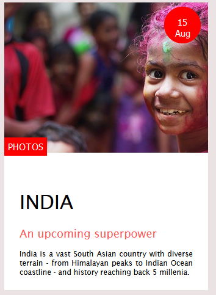
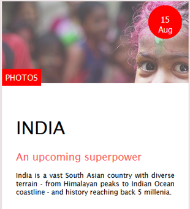

# Animation en SASS/SCSS

Durant ce projet solo, l'objectif est de réaliser une petite vignette en y appliquant des animations au moyen de SASS. 

Pour ce projet, la syntaxe SCSS a été utilisée

 

[Vignette animée](https://calcagnoloic.github.io/challenge-animation/)
